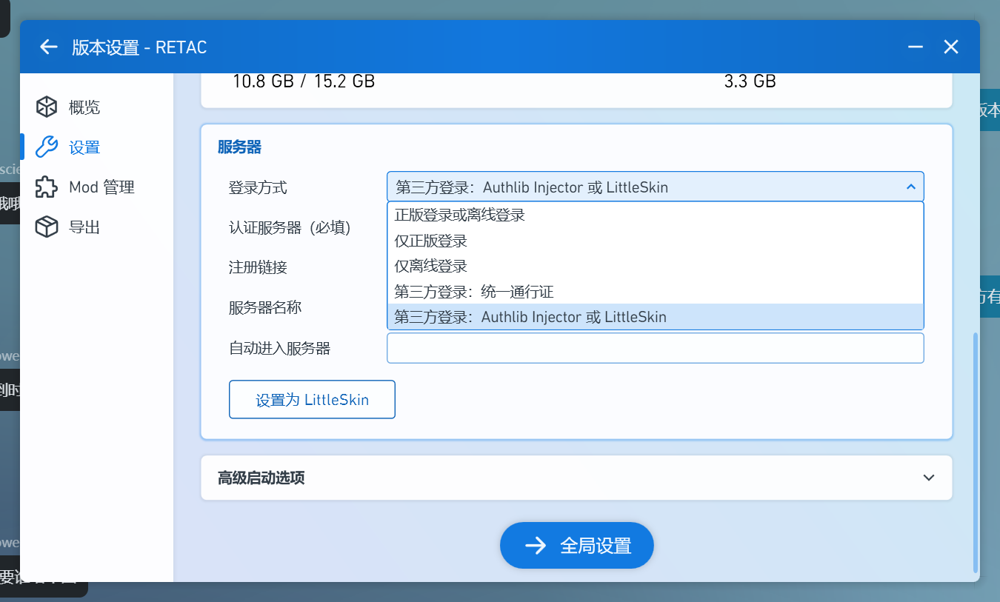
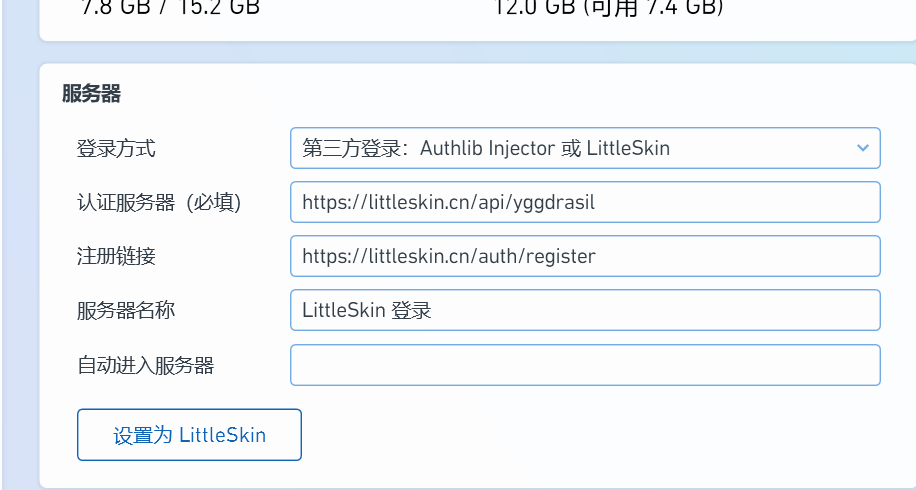

服务器使用 LittleSkin 认证，请参考以下教程进行账号注册和启动器登录。

<!-- more -->

## 注册账号

访问 [LittleSkin 官网](https://littleskin.cn/user)，并进行账户注册。注意查看自己邮箱中的验证邮件以完全激活账号。

## 创建角色

具体站内操作可以查看 [官方文档 -- 角色](https://manual.littlesk.in/newbee/player) 和 [官方文档 -- 皮肤](https://manual.littlesk.in/newbee/textures)

!!! warning-box "注意"
    虽然文档中角色名可以是中日韩文字母，但是我们强烈建议采用纯英文字符作为角色名 (游戏id)

!!! remarks "角色"
    你的 LittleSkin 账号可以创建多个角色

## 启动器登录

服务器采用 Yggdrasil 外置登录。

官方启动器暂不支持第三方认证登录，因此我们推荐采用国内主流的启动器 **HMCL** 和 **PCL**。

=== "HMCL"
    右上角 "账户" --> "LittleSkin"  
    登录时的用户名可以填写 LittleSkin 注册邮箱 (然后可以选择你的角色) 或者你的角色名 (即为该角色登录)。启动游戏时所使用的账号即为游戏内账号。
    
    详见 [官方文档 -- HMCL](https://manual.littlesk.in/yggdrasil/client)

=== "PCL"
    选择 **版本设置**，如下图
    
    
    
    填入以下内容
    
    