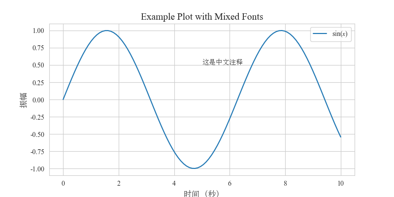

为了数模比赛以及小组作业报告/论文格式统一美观，使用 Matplotlib 绘图建议使用以下规范：

<!-- more -->

使用 Seaborn 美化，字体采用有衬线字体，公式使用latex渲染

```python
# 导入库
import matplotlib.pyplot as plt
import seaborn as sns
from matplotlib import rcParams
import matplotlib.font_manager as fm

# 觉得哪种好看
sns.set_style('whitegrid')
# sns.set_palette("Paired") # 可以设置调色板

# 设置中文字体（SimSun）
font_path = 'C:/Windows/Fonts/simsun.ttc'   # 这个应该是自己电脑的字体路径，windows 电脑应该没问题
chinese_font = fm.FontProperties(fname=font_path)

# 设置英文字体（Times New Roman）
rcParams.update({
    "font.family": "serif",  # 衬线字体
    "font.serif": ["Times New Roman"],  # 英文主字体
    "mathtext.fontset": "custom",  # 自定义数学字体
    "mathtext.rm": "Times New Roman",  # 数学公式罗马体
    "mathtext.it": "Times New Roman:italic",  # 数学公式斜体
    "mathtext.bf": "Times New Roman:bold",  # 数学公式粗体
    "axes.unicode_minus": False,  # 修复负号显示
})

# 下面的 AI 生成的一个简单示例

import numpy as np

# 生成数据
x = np.linspace(0, 10, 100)
y = np.sin(x)

# 创建图表
plt.figure(figsize=(8, 4))

# 英文标题（Times New Roman）
plt.title("Example Plot with Mixed Fonts", fontsize=14)

# 中文文本（SimSun）
plt.xlabel("时间 (秒)", fontproperties=chinese_font, fontsize=12)
plt.ylabel("振幅", fontproperties=chinese_font, fontsize=12)

# 数学公式（Times New Roman 风格）
plt.plot(x, y, label=r"$\sin(x)$")
plt.legend()

# 添加中文注释（SimSun）
plt.text(5, 0.5, "这是中文注释", fontproperties=chinese_font)

plt.grid(True)

# 保存图片为 PDF
plt.savefig("filename.pdf", dpi=300, bbox_inches="tight")
plt.show()  # 也可以显示出来看
```

大概是这样：(其实是pdf文件)



Seaborn 主题有这些：[戳这里](https://python-graph-gallery.com/104-seaborn-themes/)  
调色板有这些 [戳这里](https://www.practicalpythonfordatascience.com/ap_seaborn_palette)

--> [这些图怎么画啊喂](https://mp.weixin.qq.com/s/Hnpb3SRDy6Ri7QeFTNztrg)


