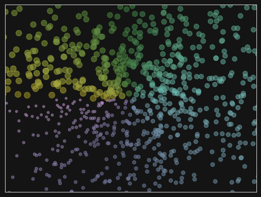
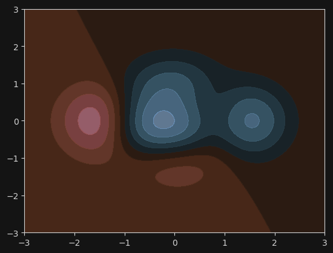

~~啊啊啊用了这么久第一次系统学~~

## 基本用法

```python
plt.figure(...)
plt.plot(...)
plt.show()
```

### 细节调整

```python
plt.xlim((1, 2))
plt.right((1, 2))

plt.xticks([1, 1.2, 1.4, 1.6, 1.8])
plt.yticks(
    [-2, -1.8, -1, 1.22, 3],
    [r'$really\ bad$', r'$bad$', r'$normal$', r'$good$', r'$really\ good$']
)  # 每个 y 值对应一个后面的 label

ax = plt.gca()
ax.spines['top'].set_color('none')  # 上方边框不显示
ax.spines['left'].set_position(('data',0))

# 显示图例，不加即默认，放在空位，即 loc='best'，也可以全都不写
plt.lagend([l1,l2], ["l1", "l2"], loc=...)    

# 文字 xytext 单位为 px
# 图中文字
plt.annotate(r'$2x+1=%s$' % y0, xy=(x0, y0), xycoords='data', xytext=(+30, -30),
             textcoords='offset points', fontsize=16,
             arrowprops=dict(arrowstyle='->', connectionstyle="arc3,rad=.2"))
# 图外文字
plt.text(-3.7, 3, r'$This\ is\ the\ some\ text. \mu\ \sigma_i\ \alpha_t$',
         fontdict={'size': 16, 'color': 'r'})
plt.text(x, y , '%.2f' % y, ha='center', va='bottom')   # 水平对齐和垂直对齐

# c: 调节颜色   
plt.scatter(X, Y, s=(T + 4) * 10, c=T, alpha=.5)
```



```python
def f(x,y):
    # the height function
    return (1 - x / 2 + x**5 + y**3) * np.exp(-x**2 -y**2)

n = 256
x = np.linspace(-3, 3, n)
y = np.linspace(-3, 3, n)
X,Y = np.meshgrid(x, y)

# use plt.contourf to filling contours
# X, Y and value for (X,Y) point
# 选用一个色带，详见 doc, 8: 台阶数
plt.contourf(X, Y, f(X, Y), 8, alpha=.75, cmap=plt.cm.RdBu)
```



> [官方色带](https://matplotlib.org/stable/users/explain/colors/colormaps.html#sequential)  
> [seaborn 色带](https://seaborn.pydata.org/tutorial/color_palettes.html#perceptually-uniform-palettes)

