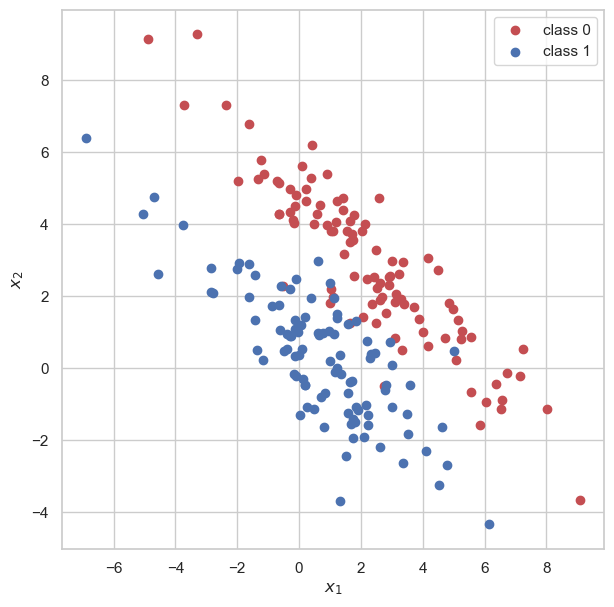
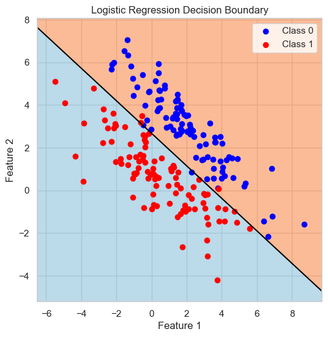
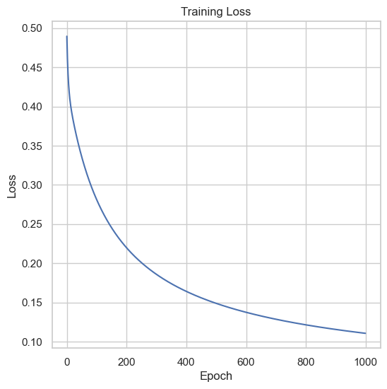

PyTorch 的简单应用: 使用 nn

## 线性回归模型构建

```python
# 还是使用上述的X和Y

X = Variable(x) # PyTorch中的 Variable 默认是允许自动求导的，所以 requires_grad=True 可以不加
Y = Variable(y) # 同上

####     超参数     ####
EPOCH = 100 # 迭代次数
learning_rate = 0.001 # 学习速率

# 定义模型
# 使用 nn包来定义我们的模型，这里的Linear表示的是线性模型，我们在初始化这个模型的时候，
# 需要传入的参数是: in_features, out_features 也就是输出特征和输出特征
# 默认会帮我们初始化权重，当然，我们也可以手动初始化权重（这里暂时不说）
model = nn.Linear(1, 1)

# 定义损失函数
# 我们使用 Mean Square Loss作为我们的损失函数
# size_average=False表示我们需要的是总的误差，不需要去平均误差
square_loss = nn.MSELoss(size_average=False)

# 定义优化方法
# 以前，我们的梯度下降法都是我们手写的，现在，我们可以使用nn为我们封装好的。
# 使用optim包来定义优化算法，可以自动的帮我们对模型的参数进行梯度更新
# model.parameters()会自动的为我们将模型中的参数提取出来。然后我们告诉优化器，它们是我们要更新的参数。
# lr表示的是学习速率
optimizer = torch.optim.SGD(model.parameters(), lr=learning_rate)

####     开始训练     ####
for t in range(EPOCH):
    # 没有变化，还是这样使用：对x进行预测
    y_hat = model(X)
    
    # 没有变化，计算损失
    loss = square_loss(y_hat, Y)
    
    # 打印损失
    if (t+1) % 20 == 0:
        print(loss)
    # 在我们反向求导之前，我们需要清空积累的梯度，由于我们使用的是 torch.optim包中的对象，我们可以直接调用
    # 该对象的方法，来自动的清空积累的梯度
    optimizer.zero_grad()
    
    # 反向求导，也没变
    loss.backward()
    
    # 反向求导结束，我们开始更新梯度，以前更新梯度需要手动输入w1.grad.data，现在只需要一行代码就可以搞定了！
    optimizer.step()
    
# 画图
plt.scatter(X.data.numpy(), Y.data.numpy())
plt.plot(X.data.numpy(), y_hat.data.numpy(), 'r-', lw = 4)
plt.show()

print("实际的参数w是： 5 \n" )
print("预测的参数w是", parameters["W"])
print("预测的常数项是：" , parameters["b"])
```

## 逻辑回归

注意：是一个分类模型，在线性回归的基础上增加 Sigmoid 函数，相当于表示概率。

$$
\sigma(x) = \frac{1}{1 + \mathrm{e}^{-x}}
$$

使用 BCE Loss，

$$
loss = - \frac{1}{N}\sum_{n = 1}^N \left(y_n \log \hat{y_n} + (1 - y_n) \log (1 - \hat{y_n}))\right), \quad y_n \in \{0, 1\}
$$

对于这样的数据



可以使用

```python
# Define Logistic Regression model
class LogisticRegression(nn.Module):
    def __init__(self, input_dim):
        super(LogisticRegression, self).__init__()
        self.linear = nn.Linear(input_dim, 1)
        
    def forward(self, x):
        return torch.sigmoid(self.linear(x))

# Initialize model
model = LogisticRegression(input_dim=2)

# Loss and optimizer
criterion = nn.BCELoss()  # Binary Cross Entropy Loss
optimizer = torch.optim.SGD(model.parameters(), lr=0.1)

# Training loop
epochs = 1000
losses = []

for epoch in range(epochs):
    # Forward pass
    outputs = model(X_tensor)
    loss = criterion(outputs, y_tensor)
    losses.append(loss.item())
    
    # Backward pass and optimize
    optimizer.zero_grad()
    loss.backward()
    optimizer.step()
    
    if (epoch+1) % 100 == 0:
        print(f'Epoch [{epoch+1}/{epochs}], Loss: {loss.item():.4f}')

# Plotting the decision boundary
w = model.linear.weight.detach().numpy()[0]
b = model.linear.bias.detach().numpy()

x_min, x_max = X[:, 0].min() - 1, X[:, 0].max() + 1
y_min, y_max = X[:, 1].min() - 1, X[:, 1].max() + 1
xx, yy = np.meshgrid(np.linspace(x_min, x_max, 100),
                     np.linspace(y_min, y_max, 100))
Z = model(torch.tensor(np.c_[xx.ravel(), yy.ravel()], dtype=torch.float32)).detach().numpy()
Z = Z.reshape(xx.shape)

plt.figure(figsize=(10, 6))
plt.contourf(xx, yy, Z, levels=[0, 0.5, 1], cmap=plt.cm.RdYlBu, alpha=0.6)
plt.scatter(r0[:, 0], r0[:, 1], c='blue', label='Class 0')
plt.scatter(r1[:, 0], r1[:, 1], c='red', label='Class 1')
plt.contour(xx, yy, Z, levels=[0.5], colors='black')
plt.title('Logistic Regression Decision Boundary')
plt.xlabel('Feature 1')
plt.ylabel('Feature 2')
plt.legend()
plt.show()

# Plot training loss
plt.figure(figsize=(10, 4))
plt.plot(losses)
plt.title('Training Loss')
plt.xlabel('Epoch')
plt.ylabel('Loss')
plt.show()
```

可以得到划分

{ style="width:50%; float:left;" }
{ style="width:50%; float:right;" }
