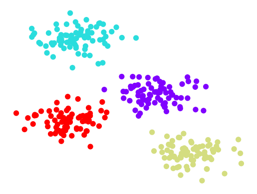
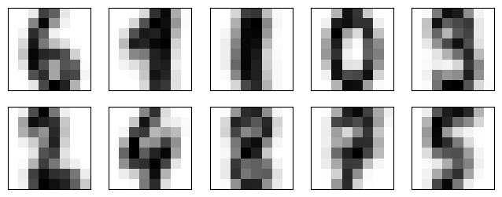
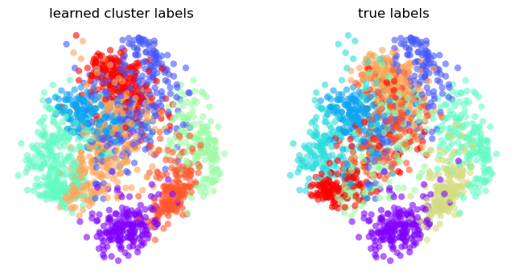
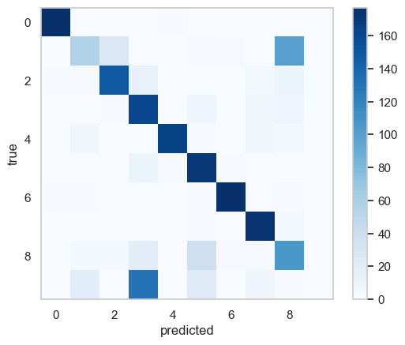
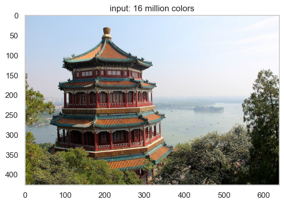
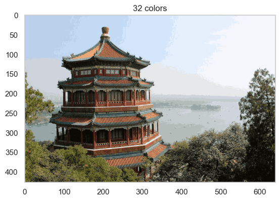

一种非监督学习的聚类方法

## 基本原理

它每次都会根据数据的分布去寻找聚类中心。每一个点都被划分为不同的分类，每一个点与自己类别的中心在距离上都是最近的。



### K-means 算法：最大期望

K-Means 是一个灵活运用了*最大期望*的方法去获得解决方法的算法。
*最大期望*是一个由下面的两步构成的方法：

1. 猜测类别的中心  
2. 重复下面的步骤直到收敛  
      A. 将数据点归为最近的中心所对应的分类  
      B. 根据该类别的现有的数据点的分布，更新该类别中心  

!!! remarks "关于收敛性"
      KMeans并不能保证最后的结果一定是收敛的。所以，scikit-learn初始化了很多随机值，去寻找最优的结果。

## 应用

### 手写识别

```python
est = KMeans(n_clusters=10)
clusters = est.fit_predict(digits.data)
```

显示 10 个分类出的中心有

```python
fig = plt.figure(figsize=(8, 3))
for i in range(10):
    ax = fig.add_subplot(2, 5, 1 + i, xticks=[], yticks=[])
    ax.imshow(est.cluster_centers_[i].reshape((8, 8)), cmap=plt.cm.binary)

plt.show()
```



我们发现数字的顺序被改变了。可以使用

```python
from scipy.stats import mode

labels = np.zeros_like(clusters)
for i in range(10):
    mask = (clusters == i)
    labels[mask] = mode(digits.target[mask])[0]
```

根据聚类结果 `clusters`，将每个聚类簇编号（如 0~9）映射为真实标签中出现最多的类别，从而获得正确的分类。

将其与 PCA 得到的标签对比

```python
from sklearn.decomposition import PCA

X = PCA(2).fit_transform(digits.data)

kwargs = dict(cmap = plt.cm.get_cmap('rainbow', 10),
              edgecolor='none', alpha=0.6)
fig, ax = plt.subplots(1, 2, figsize=(8, 4))
ax[0].scatter(X[:, 0], X[:, 1], c=labels, **kwargs)
ax[0].set_title('learned cluster labels')

ax[1].scatter(X[:, 0], X[:, 1], c=digits.target, **kwargs)
ax[1].set_title('true labels')

for ax in ax:
    ax.axis('off')

plt.show()
```



绘制混淆矩阵有

```python
plt.imshow(confusion_matrix(digits.target, labels),
           cmap='Blues', interpolation='nearest')
plt.colorbar()
plt.grid(False)
plt.ylabel('true')
plt.xlabel('predicted')

plt.show()
```

{ style:"width:70%" }

再一次说明，这是一个**完全的无监督的估计**，它达到了80%的正确率。

### 颜色压缩

假设有一幅拥有百万种颜色的图片。在大部分的图片中，大量的颜色不会被使用，或者很大一部分的像素拥有相似或者相同的颜色。

对于一张图片，

```python
from sklearn.datasets import load_sample_image
china = load_sample_image("china.jpg")

X = (china / 255.0).reshape(-1, 3)
```

我们现在有 273,280 个3维数据点 (RGB)。

我们的任务就是运用KMeans去压缩$256^3$种颜色，让颜色的种类总数减小（比如减到32色）。我们想在所有的数据中寻找$N_{color}$个类别中心，然后去用这32个类别中心去创建一副新的图像，在这个新的图像中，原有图像数据中的颜色会根据就近原则被最近的数据中心的颜色代替。

在这里我们使用``MiniBatchKMeans``，一个更完备，适用于更大的数据集的预测器：

```python
from sklearn.cluster import MiniBatchKMeans

n_colors = 32

X = (china / 255.0).reshape(-1, 3)
    
model = MiniBatchKMeans(n_colors)
labels = model.fit_predict(X)
colors = model.cluster_centers_
new_image = colors[labels].reshape(china.shape)
new_image = (255 * new_image).astype(np.uint8)
```

可以看到颜色的数量减少了，但是仍旧保留了图片的整体信息。

{ style="width:50%; float:left;" }
{ style="width:50%; float:right;" }