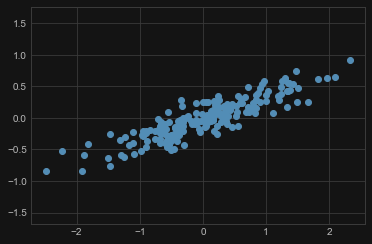
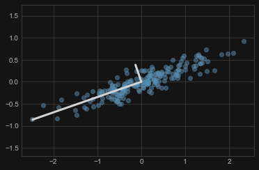
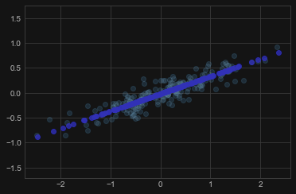
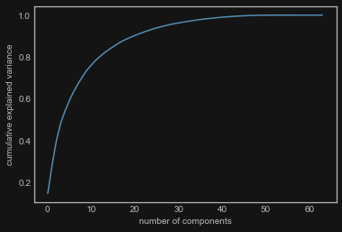
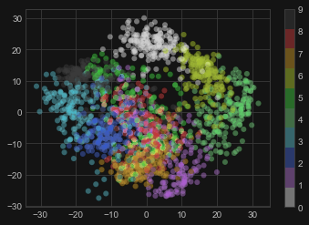
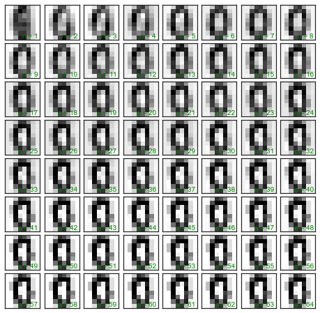

一种非监督学习的降维方法

## 基本原理

### 处理过程

对这样的数据集



我们可以看出这一组数据有一个明显的趋势和走向。主成分分析(PCA)做的就是去寻找这一组数据中的**最基本的轴**，然后去解释这些轴是怎样影响数据分布的。

```python
from sklearn.decomposition import PCA

pca = PCA(n_components=2)
pca.fit(X)
```

输出 `pca.explained_variance_` 为 `[0.7625315 0.0184779]`，`pca.components_` 为 `[[-0.94446029 -0.32862557]
 [-0.32862557  0.94446029]]`。将其绘制在图上为：



我们注意到一个向量比另一个向量长。从某种意义上来说，它告诉我们这个长向量对应的数据方向比另一个方向要"重要"。方差量化了方向的"重要性"。

降低保持的方差，可以忽略一些次要成分。下面是舍弃 $5%$ 方差的结果

```python
clf = PCA(0.95) # 保持95%的方差
X_trans = clf.fit_transform(X)

X_new = clf.inverse_transform(X_trans)
plt.plot(X[:, 0], X[:, 1], 'o', alpha=0.2)
plt.plot(X_new[:, 0], X_new[:, 1], 'ob', alpha=0.8)
plt.axis('equal');
```



在图中，浅色的点是原始数据，深色的点是经过投射和压缩后的点。我们可以看到，在舍弃了5%的数据方差之后，数据集中最重要的特征被保留了下来，而且我们的数据总量被压缩了一半！

这就是"主成分分析"所做的：如果将数据近似在一个低的维度，您就可以轻松的去观察这个数据或者为这个数据添加更复杂的模型。

### "成分"指的是什么？

对于图片来说，如果对其直接降维会导致我们只能看到图片的部分像素。而将图片表示的向量进行一个线性变换后，我们只需要很少的信息就能够得到一个效果不错的近似。低维数据的表达是这个序列中的参数。

### 选择成分的数量

在我们舍弃次要的成分时，我们究竟舍弃了多少信息？我们可以画出**解释方差**，从图中得到我们想要的答案。

```python
pca = PCA().fit(X)
plt.plot(np.cumsum(pca.explained_variance_ratio_))
plt.xlabel('number of components')
plt.ylabel('cumulative explained variance')
```



## 相关应用

### 手写识别

对于 64 维的手写识别数据，我们用 PCA 将其投射到平面上。

```python
from sklearn.datasets import load_digits
digits = load_digits()
X = digits.data
y = digits.target

pca = PCA(2)  # 将64个维度投射在2个维度
Xproj = pca.fit_transform(X)

plt.scatter(Xproj[:, 0], Xproj[:, 1], c=y, edgecolor='none', alpha=0.5,
            cmap=plt.cm.get_cmap('nipy_spectral', 10))
plt.colorbar()
```



> 上图中横纵轴表示两个主成分，`c=y` 表示每个点的颜色对应它的数字标签（0~9）

上图可以观察到不同数字的关联和差异。

### 数据压缩

下面是改变不同成分的数目时同一对象的压缩结果。



## 其它的降维算法

Scikit-learn中还有门多其他的无监督学习的方法

- [sklearn.decomposition.PCA](http://scikit-learn.org/0.13/modules/generated/sklearn.decomposition.PCA.html): 
   主成分分析
- [sklearn.decomposition.RandomizedPCA](http://scikit-learn.org/0.13/modules/generated/sklearn.decomposition.RandomizedPCA.html):
   基于随机算法的高速的主成分分析
- [sklearn.decomposition.SparsePCA](http://scikit-learn.org/0.13/modules/generated/sklearn.decomposition.SparsePCA.html):
   包含L1正则化惩罚的PCA
- [sklearn.decomposition.FastICA](http://scikit-learn.org/0.13/modules/generated/sklearn.decomposition.FastICA.html):
   独立成分分析
- [sklearn.decomposition.NMF](http://scikit-learn.org/0.13/modules/generated/sklearn.decomposition.NMF.html):
   非负矩阵因子分解
- [sklearn.manifold.LocallyLinearEmbedding](http://scikit-learn.org/0.13/modules/generated/sklearn.manifold.LocallyLinearEmbedding.html):
   基于邻居算法的非线性流形学习技术
- [sklearn.manifold.IsoMap](http://scikit-learn.org/0.13/modules/generated/sklearn.manifold.Isomap.html):
   基于稀疏图算法的非线性流形学习算法

详见 [scikit-learn website](http://sklearn.org)。
