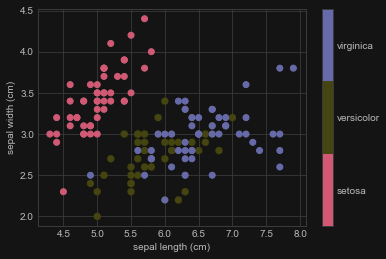

## 关于Scikit-Learn

[Scikit-Learn](http://github.com/scikit-learn/scikit-learn)是一个采用**简洁并灵活的 API**，向用户提供**广为人知**的机器学习算法的Python包。它由上百个贡献者所开发，并且已经广泛运用至工业界和学术界中。

Scikit-Learn依赖于Python的 [NumPy (Numerical Python)](http://numpy.org) 和 [SciPy (Scientific Python)](http://scipy.org)库，它们为Python中高效的数值和科学计算提供了支持。scikit-learn本身并不是为极大的数据集量身定做的，但是也有[一些工作](https://github.com/ogrisel/parallel_ml_tutorial)是基于此的。

## 鸢尾花（iris dataset）分类的全流程例子

加载和读取数据

```python
# 导入 sklearn
from sklearn import neighbors, datasets, preprocessing
from sklearn.model_selection import train_test_split
from sklearn.metrics import accuracy_score
import pandas as pd

# 加载数据
# https://scikit-learn.org/stable/modules/generated/sklearn.datasets.load_iris.html
iris = datasets.load_iris()

# 查看iris原始数据
print(pd.DataFrame(iris.data, columns=iris.feature_names).head())
print(iris.target)
```

划分训练集和测试集

```python
X, y = iris.data[:, :2], iris.target
X_train, X_test, y_train, y_test = train_test_split(X, y, random_state=33)
```

> `iris.data` 是一个二维数组（150×4），代表 150 个样本的 4 个特征：  
> - 花萼长度（sepal length）
> - 花萼宽度（sepal width）
> - 花瓣长度（petal length）
> - 花瓣宽度（petal width）  
> 
> `iris.target` 是对应的标签（0, 1, 2），表示三种不同的鸢尾花品种。  
> 只取前两个特征（花萼长度 & 花萼宽度）作为特征矩阵 `X`，用于可视化或简化模型任务。这是一种基于投影的降维操作。
>   


> `random_state=33`：设置随机种子，确保每次运行都划分相同（便于结果复现）  
> 默认 `train_test_split` 是 75% 训练集 + 25% 测试集

数据预处理

```python
scaler = preprocessing.StandardScaler().fit(X_train)
X_train = scaler.transform(X_train)
X_test = scaler.transform(X_test)
```

> `scaler ` 是 **标准化器** (StandardScaler)，它会 **“学”训练集的均值与标准差** ，并记住这些值。  
> `scaler.transform()` 用上一步“学到的均值和标准差”来 **转换训练集和测试集**。即 
> 
> $$
 x' = \frac{x - \mu}{\sigma}
 $$

!!! warning-box "只能用训练集来计算均值和标准差！"
    否则测试集就“泄漏”信息给模型了，违背机器学习的基本原则

模型训练

```python
# 创建模型
knn = neighbors.KNeighborsClassifier(n_neighbors=5)
# 模型拟合
knn.fit(X_train, y_train)
```

> 这里用的是 [**KNN** (KNeighborsClassifier)](https://abiesjqq.github.io/Abies_Notebook/NoflowersNotes/ComputerVision/Intro%26K-NN/#k-neatest-neighbours)

模型预测评估

```python
# 预测
y_pred = knn.predict(X_test)
# 评估
accuracy_score(y_test, y_pred)
```

## Scikit-learn中的数据导入与表示

在Scikit-learn中，大多数的机器学习算法的数据在二维的数组或者矩阵中存储。这些数据可能是``numpy``数组，在某些情况下也可能是``scipy.sparse``矩阵。数组的大小应该是`[样本（sample）数，特征（feature）数]` 。

- **样本数（n_sample）:** 样本的数目。每一个样本都是一个需要处理的独立个体（例如：需要被分类），一个样本可能是一个文档、一幅图片、一段音频、一段视频、一个天文学数据、数据库或者CSV文件中的一行，或者任意一个确定的数值的集合。
- **特征数（n_feature）:** 特征的数目，特征是描述一个样本的数值表达。特征一般是实数，不过在某些情况下也会是布尔值或者是离散数据。

特征数必须提前确定。但是对于给定的样本，特征可以是很大（百万级）的一个零占大多数的集合。这种情况下，`scipy.sparse`矩阵就派上了用场，用这个矩阵比numpy矩阵在存储上会更加高效。

### Scikit-learn 中的其它内置数据

它们分为如下三种：

- **包内置数据：** 这些小的数据集已经被集成在scikit-learn的安装包里面了，可以用``sklearn.datasets.load_*``去下载它
- **供下载数据：** 这些较大的数据可以供用户们下载，scikit-learn里面已经包含了下载这些数据集的流通道。这些数据可以在``sklearn.datasets.fetch_*``中找到。
- **生成数据：** 通过随机种子，可以通过现有模型随机生成一些数据集。它们可以在``sklearn.datasets.make_*``中找到

=== "乳腺癌数据集"
    ```python
    from sklearn.datasets import load_breast_cancer
    X_breast, y_breast = load_breast_cancer(return_X_y=True)
    
    from sklearn.model_selection import train_test_split
    X_breast_train, X_breast_test, y_breast_train, y_breast_test = train_test_split(X_breast, y_breast, stratify=y_breast, random_state=0, test_size=0.3)
    ```
    > 使用`sklearn.model_selection.train_test_split`拆分数据集并保留30％的数据集以进行测试。确保对数据进行分层（即使用 `stratify`参数）并将`random_state`设置为`0`。
    
    使用 **梯度提升分类器**（Gradient Boosting Classifier）进行训练和预测
    
    ```python
    from sklearn.ensemble import GradientBoostingClassifier
    
    clf = GradientBoostingClassifier(n_estimators=100, random_state=0)
    clf.fit(X_breast_train, y_breast_train)
    y_pred = clf.predict(X_breast_test)
    ```
    
    计算准确率
    
    ```python
    from sklearn.metrics import accuracy_score
    
    accuracy = accuracy_score(y_breast_test, y_pred)
    print('Accuracy score of the {} is {:.2f}'.format(clf.__class__.__name__, accuracy))
    ```

=== "手写数字（Digits）数据集"
    ```python
    from sklearn.datasets import load_digits
    X_digits, y_digits = load_digits(return_X_y=True)
    ```
=== "波士顿房价（California Housing 替代版）"
    ```python
    from sklearn.datasets import fetch_california_housing
    X_house, y_house = fetch_california_housing(return_X_y=True)
    ```

## Scikit-learn 中的 Estimator 对象

每一个在scikit-learn中实现的算法都是表示为一个 "Estimator" 的对象。

**Estimator 参数**：一个 Estimator 对象的所有系数可以在它初始化的时候设置，这些系数拥有普适性的初始值。

```python
model = LinearRegression(normalize=True)
print(model.normalize)
```

```output
True
```

**Estimator 模型参数**：当Estimator用数据来拟合系数时，模型的系数是根据数据一步步得到的。所有的模型系数都是Estimator对象的属性，并且以一个下划线(underscore)结尾。

```python
model = LinearRegression(normalize=True)
...
model.fit(X, y)
# 以下划线结尾，代表了一个拟合的系数
print(model.coef_)
print(model.intercept_)
# 残差
print(model._residues)
```


本笔记修改并总结自[Jake Vanderplas](http://www.vanderplas.com) 和**郑冠杰**老师的课件，源代码和license文件在[GitHub](https://github.com/jakevdp/sklearn_tutorial/)。 