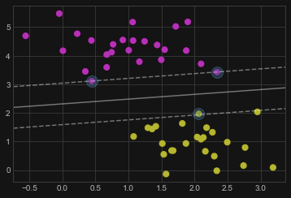
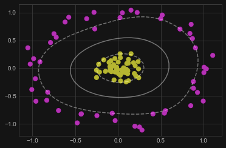
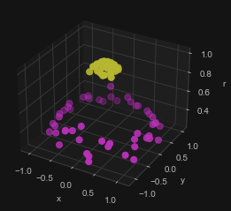
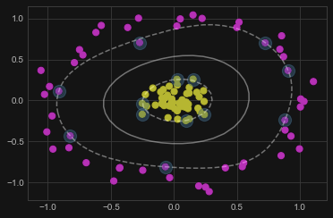

一种监督学习的分类方法

## 基本原理

支持向量机（SVMs）是监督学习中用来**分类**或者**回归**的最强大的算法之一。支持向量机是一种**判别分类器**：它可以在数据的集合中画出一条分割线。

它会优化分隔的直线，使得直线的**边界**与数据集的垂直距离最大。

## 直线分割

```python
from sklearn.svm import SVC  # "Support Vector Classifier"

clf = SVC(kernel='linear')
clf.fit(X, y)
```

可以得到这样的分割直线


边界碰到的点就是所谓的 **_支持向量_**， 在scikit-learn中，这些支持向量被存储在分类器的``suppport_vectors_``属性中

```python
plt.scatter(X[:, 0], X[:, 1], c=y, s=50, cmap='spring')
plot_svc_decision_function(clf)
plt.scatter(clf.support_vectors_[:, 0], clf.support_vectors_[:, 1],
            s=200, alpha=0.3);
```



## 核方法

核方法可以用来转换不能线性分割的数据集。

例如对于难以线性分割的数据集



可以使用径向基函数，把 `r` 作为第三个维度，

```python
r = np.exp(-(X[:, 0] ** 2 + X[:, 1] ** 2))
```

得到



在 Scikit-learn 中，可以通过使用``kernel='rbf'``来实现，其中rbf是*radial basis function*的缩写。

```python
clf = SVC(kernel='rbf')
clf.fit(X, y)
```

得到的分割以及支持向量为



!!! remarks "补充说明"
    关于 SVM 和 核方法的相关推到详见 https://zhuanlan.zhihu.com/p/131674827