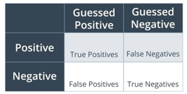

## 数值处理

### 归一化

1. Minmax 缩放

```python
data_scaler_minmax = preprocessing.MinMaxScaler(feature_range=(0, 1))
data_scaled_minmax = data_scaler_minmax.fit_transform(input_data)
```

2. 标准化

$$
x' = \frac{x - \mu}{\sigma}
$$

### 二值化

1. 按判据转换为布尔值

```python
data_binarized = preprocessing.Binarizer(threshold=0.5),transform(input_data)
```

2. OneHot 编码

```python
onehot_encoder = preprocessing.OneHotEncoder(sparse=False)
encoded = onehot_encoder.fit_transform(input_data)
```

> `sparse=False` 表示输出的矩阵不是稀疏矩阵

## 数据分割

!!! warning-box "注意"
    不要把测试数据泄露给训练集！

## 模型验证

例如在 KNN 下，构建混淆矩阵

```python
from sklearn.matrics import confusion_matrix
confusion_matrix(y, y_pred)
```

在训练集和测试集上结果不同



- Accuracy (准确度) 指 

$$
\frac{|y = \hat{y}|}{|y|}
$$

- Precision (精确度) 指

$$
\frac{|\hat{y} = 1 \&\& y = 1|}{|\hat{y} = 1|}
$$

- Recall (召回率) 指

$$
\frac{|\hat{y} = 1 \&\& y = 1|}{|y = 1|}
$$

在实践中，Prcision 增加时 Recall 会降低。例如在疾病诊断中需要提高 Recall，故可以适当降低 Precision，也即增加 $|\hat{y} = 1|$ 