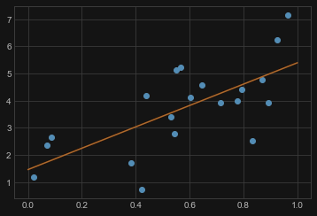
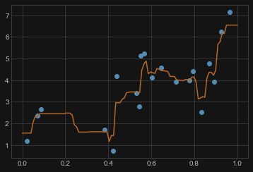
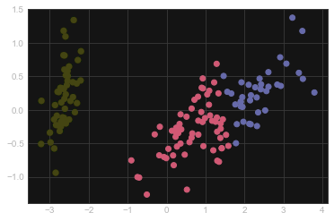

## 监督学习：分类与回归

在**监督学习**中，我们会有一个同时包含特征(feature)和标签(label)的数据集。我们的任务是，对于给定的对象特征，去建立一个Estimator预测对该对象的标签。一个相对简单的例子是，我们给出对于iris这种花的测量，去预测iris花的具体品种。这是一个相对简单的任务，更多的较为复杂的任务见下方：

- 给出一个通过望远镜得到的彩色图片，预测出该物体是一个恒星，一个类星体或者一个星系。
- 给出一个人的照片，识别出这个人的信息。
- 给出一个人看过的电影，和这些电影的得分，推荐给这个人他可能喜欢的其他电影（也就是：*推荐系统*: 一个非常著名的例子可以参考 [Netflix Prize](http://en.wikipedia.org/wiki/Netflix_prize)）。

这些任务的共同特点就是，我们需要利用事物观测到的各种特征，去预测一个或多个未知的，与这个事物有关的其他特征。

进一步的，监督学习可以被划分成两个大类，即**分类**(classification)和**回归**(regression)。在分类问题中，对象的标签是离散的，在回归问题中，对象的标签是连续的。举个例子，在天文学中，判断一个物体是一个恒星，一个类星体或者是一个星系是一个分类的问题：这个三种标签来自于三个独立的类别。另一方面，我们可能希望去根据这些观测，预测物体的年龄，这就是一个回归的问题了，因为这个标签（年龄）是一个连续的数字。

!!! remarks "注意"
    本文中的部分算法将在后续笔记中详细介绍

### 分类算法简介

K-NN、SVC, 详见 [CV](https://abiesjqq.github.io/Abies_Notebook/NoflowersNotes/ComputerVision/Intro%26K-NN/).

### 回归算法简介

#### `LinearRegression` 线性拟合

```python
model = LinearRegression()
model.fit(X, y)

# 画出数据和模型预测之间的图形
X_fit = np.linspace(0, 1, 100)[:, np.newaxis]
y_fit = model.predict(X_fit)

plt.plot(X.squeeze(), y, 'o')
plt.plot(X_fit.squeeze(), y_fit);
```



#### `RandomForestRegressor` 随机森林回归

_该算法将在后续深入介绍_

```python
# 训练一个随机森林(Random Forest)模型
from sklearn.ensemble import RandomForestRegressor

model = RandomForestRegressor()
model.fit(X, y)

# 画出数据和模型预测之间的图形
X_fit = np.linspace(0, 1, 100)[:, np.newaxis]
y_fit = model.predict(X_fit)

plt.plot(X.squeeze(), y, 'o')
plt.plot(X_fit.squeeze(), y_fit);
```



## 无监督学习：降维(Dimensionality Reduction)和聚类(Clustering)

**无监督学习**从问题的另一个角度去考虑。数据在这里是没有标签的，我们感兴趣的是问题中对象的相似点。从某种程度上说，您可以认为无监督学习是一种从数据本身去发掘标签的方法。无监督学习有*降维*(dimensionality reduction)
、聚类(clustering)和密度估计(density estimation)等算法。举个例子，在我们之前所说的iris数据中，我们可以利用无监督学习去发现哪一种测量的组合最能体现数据的结构。我们接下来会看到，这样一种数据的投影能够被用来在二维空间中展现四维的数据集。还有一些更贴切的无监督学习的问题：

- 给出遥远星系的详细的观测数据，决定哪一个或哪几个特征是最能体现其数据的
- 给出两种声源的混合（比如一个人在音乐声中谈话），分离出两种声音（这叫做 [盲源分离](http://en.wikipedia.org/wiki/Blind_signal_separation) ）
- 给出一段视频，分离出其中运动的物体，并且与其他运动物体比较，给出分类

有些时候监督学习和无监督学习会组合在一起：无监督学习可以用来从有多个类别的数据中找到有用的特征，而获取的这些特征可以被用在一个监督学习的框架中。

### 降维算法简介

#### `PCA` 主成分分析

主成分分析（Principle Component Analysis, PCA）是一个降维算法，它可以找到能达到最大方差的最佳变量的组合。_该算法将在后续深入介绍_

```python
X, y = iris.data, iris.target

from sklearn.decomposition import PCA

pca = PCA(n_components=0.95)
pca.fit(X)
X_reduced = pca.transform(X)
print("Reduced dataset shape:", X_reduced.shape)

import matplotlib.pyplot as plt

plt.scatter(X_reduced[:, 0], X_reduced[:, 1], 
            c=y, cmap='RdYlBu')
```


#### `KMeans` K-means 聚类

聚类算法针对观测到的数据，根据给定的准则发现它们的共同点，在数据集中寻找“群”。  
注意，这些聚类(cluster)会从数据中发现一些隐藏的相关结构，如果所使用到的标准展现出了这些结构

```python
from sklearn.cluster import KMeans
X, y = iris.data, iris.target
k_means = KMeans(n_clusters=3, random_state=0) # Fixing the RNG in kmeans
k_means.fit(X)
y_pred = k_means.predict(X)

plt.scatter(X_reduced[:, 0], X_reduced[:, 1], c=y_pred,
           cmap='RdYlBu');
```

