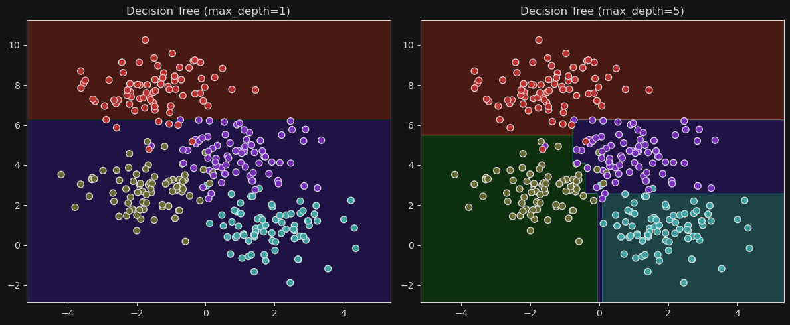
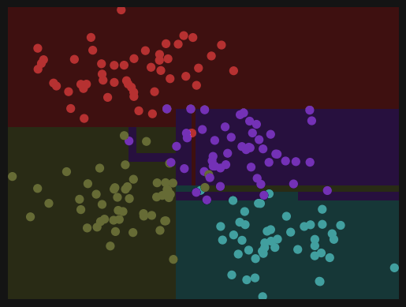
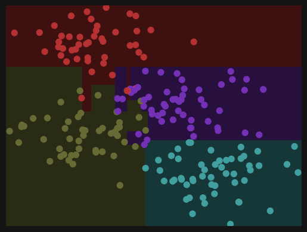
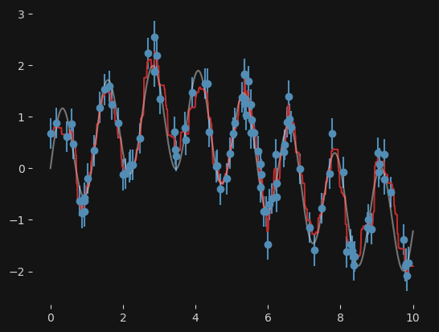
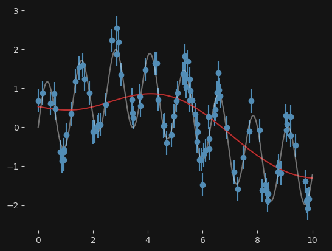
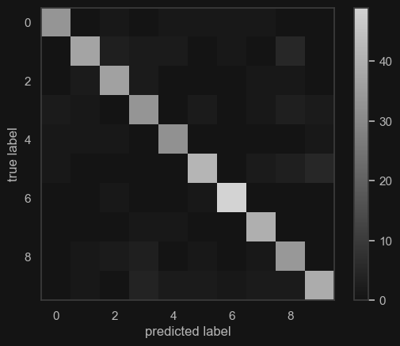

一种监督学习的回归方法（非参数）

## 决策树

不做介绍

```python
import matplotlib.pyplot as plt
from sklearn.datasets import make_blobs
from sklearn.tree import DecisionTreeClassifier
import numpy as np

# 生成数据
X, y = make_blobs(n_samples=300, centers=4,
                  random_state=0, cluster_std=1.0)

# 创建画布
fig, axes = plt.subplots(1, 2, figsize=(12, 5))

# 不同深度的模型
for ax, depth in zip(axes, [1, 5]):
    tree = DecisionTreeClassifier(max_depth=depth, random_state=0).fit(X, y)

    # 创建网格点用于绘图
    x_min, x_max = X[:, 0].min() - 1, X[:, 0].max() + 1
    y_min, y_max = X[:, 1].min() - 1, X[:, 1].max() + 1
    xx, yy = np.meshgrid(np.linspace(x_min, x_max, 300),
                         np.linspace(y_min, y_max, 300))
    Z = tree.predict(np.c_[xx.ravel(), yy.ravel()])
    Z = Z.reshape(xx.shape)

    # 绘制决策边界和数据点
    ax.contourf(xx, yy, Z, alpha=0.3, cmap='rainbow')
    ax.scatter(X[:, 0], X[:, 1], c=y, s=50, cmap='rainbow', edgecolor='k')
    ax.set_title(f"Decision Tree (max_depth={depth})")

plt.tight_layout()
plt.show()

```



注意到随着深度的增加，**除了**那些本来只包含一类的点之外，每一个数据集都被成功的划分。 这是个非常快的**无参数**
分类过程，在实际运用中非常实用。

**但是**，决策树的一个特点就是，它训练出来的模型非常容易产生**过拟合**
。也就是说，模型的弹性非常大，以至于它们对数据的噪声的学习可以高过数据本身！例如下面是针对一个数据集的两个部分的预测模型


{ style="width:50%; float:left;" }
{ style="width:50%; float:right;" }

<div style="clear:both"></div>

可见两个模型的细节完全不一样。

## 随机森林

一个可能的解决过拟合问题的方式是采用**集成方法**
：创建一个总的estimator，它对很多的独立的，容易产生过拟合的estimator取了平均。让人有些惊讶的是，这个总的estimator的效果非常好，它比任何一个组成它的独立的estimator都要稳定和精确！

**随机森林**就是众多集成方法中的一种，这里，集成的意思是总的estimator会由很多决策树组成。

具体使用见下面的例子：

```python
from sklearn.ensemble import RandomForestRegressor
import numpy as np
from matplotlib import pyplot as plt

x = 10 * np.random.rand(100)


# model 用于生成噪声sigma加成下的函数值
def model(x, sigma=0.3):
    fast_oscillation = np.sin(5 * x)
    slow_oscillation = np.sin(0.5 * x)
    noise = sigma * np.random.randn(len(x))

    return slow_oscillation + fast_oscillation + noise


y = model(x)

xfit = np.linspace(0, 10, 1000)
yfit = RandomForestRegressor(100).fit(x[:, None], y).predict(xfit[:, None])
ytrue = model(xfit, 0)  # 真实正弦函数值

plt.errorbar(x, y, 0.3, fmt='o')
plt.plot(xfit, yfit, '-r');
plt.plot(xfit, ytrue, '-k', alpha=0.5);
plt.show()
```

该模型不用指定周期参数就能很好的拟合该含有噪声的曲线；与之相对的，SVM 模型就难以很好地拟合。

{ style="width:50%; float:left;" }
{ style="width:50%; float:right;" }

<div style="clear:both"></div>

## 手写数字分类

```python
from sklearn.model_selection import train_test_split
from sklearn import metrics
from sklearn.tree import DecisionTreeClassifier

Xtrain, Xtest, ytrain, ytest = train_test_split(X, y, random_state=0)
clf = DecisionTreeClassifier(max_depth=11)
clf.fit(Xtrain, ytrain)
ypred = clf.predict(Xtest)
```

画出混淆矩阵

```python
plt.imshow(metrics.confusion_matrix(ypred, ytest),
           interpolation='nearest', cmap=plt.cm.binary)
plt.grid(False)
plt.colorbar()
plt.xlabel("predicted label")
plt.ylabel("true label")

plt.show()
```

{ style="width:45%;" }

> 本笔记修改自[Jake Vanderplas](http://www.vanderplas.com)，源代码和license文件在[GitHub](https://github.com/jakevdp/sklearn_tutorial/)。 
