## ggplot2 基础结构

ggplot 的语法基于 **图形语法 (Grammar of Graphics)**：

```r
ggplot(data, aes(x, y)) + geom_xxx() + ... 
```

-   `data`：数据集

-   `aes()`：映射（x 轴、y 轴、颜色、大小、形状等

-   `geom_xxx()`：几何对象（点、线、柱状图……）

-   `+`：叠加图层

先加载示例数据

```r
library(ggplot2)

data(mtcars)
head(mtcars)
```

    ##                    mpg cyl disp  hp drat    wt  qsec vs am gear carb
    ## Mazda RX4         21.0   6  160 110 3.90 2.620 16.46  0  1    4    4
    ## Mazda RX4 Wag     21.0   6  160 110 3.90 2.875 17.02  0  1    4    4
    ## Datsun 710        22.8   4  108  93 3.85 2.320 18.61  1  1    4    1
    ## Hornet 4 Drive    21.4   6  258 110 3.08 3.215 19.44  1  0    3    1
    ## Hornet Sportabout 18.7   8  360 175 3.15 3.440 17.02  0  0    3    2
    ## Valiant           18.1   6  225 105 2.76 3.460 20.22  1  0    3    1

## 基础图形

### 散点图

```r
ggplot(mtcars, aes(x = wt, y = mpg)) +
  geom_point()
```


颜色、大小映射

```r
ggplot(mtcars, aes(x = wt, y = mpg, color = factor(cyl), size = hp)) +
  geom_point()
```
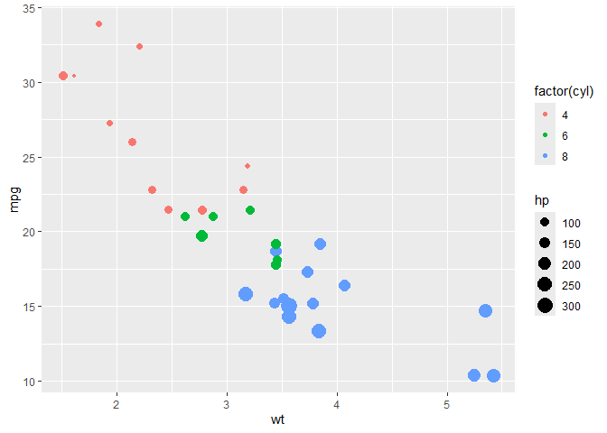

> `factor()` 基于…分类

回归线

```r
ggplot(mtcars, aes(x = wt, y = mpg)) +
  geom_point() +
  geom_smooth(method = "lm")   # 线性回归线，lm 指平滑曲线
```
    ## `geom_smooth()` using formula = 'y ~ x'

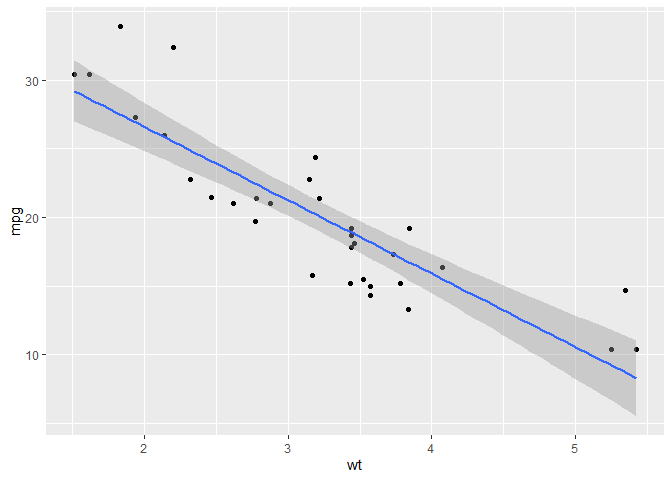

### 折线图

基本

```r
sales <- data.frame(
  month = 1:12,
  value = c(120, 135, 150, 160, 145, 180, 200, 190, 210, 220, 230, 240)
)

ggplot(sales, aes(x = month, y = value)) +
  geom_line(color = "steelblue") + 
  geom_point(color = "steelblue", size = 2)
```


多组

```r
sales2 <- data.frame(
  month = rep(1:12, 2),
  value = c(
    c(120, 135, 150, 160, 145, 180, 200, 190, 210, 220, 230, 240),  # 部门A
    c(100, 115, 130, 140, 135, 150, 170, 175, 190, 195, 205, 215)   # 部门B
  ),
  dept = rep(c("A", "B"), each = 12)
)

ggplot(sales2, aes(x = month, y = value, color = dept)) +
  geom_line(size = 1.2) +
  geom_point()
```


日期 (会自动优化程序包)

```r
library(lubridate)

sales_date <- data.frame(
  date = seq(as.Date("2023-01-01"), by = "month", length.out = 12),
  value = c(120, 135, 150, 160, 145, 180, 200, 190, 210, 220, 230, 240)
)

ggplot(sales_date, aes(x = date, y = value)) +
  geom_line(color = "darkgreen") +
  geom_point(size = 2)
```
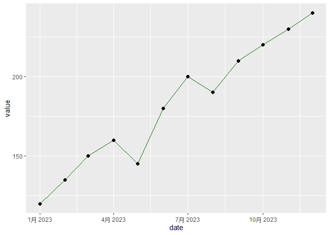

平滑线

```r
ggplot(sales2, aes(x = month, y = value, color = dept)) +
  geom_point() +
  geom_smooth(se = FALSE)   # 默认用 loess 平滑
```


### 柱状 / 条形图

基本版（计数的）

```r
ggplot(mtcars, aes(x = factor(cyl))) +
  geom_bar(fill = "steelblue")
```
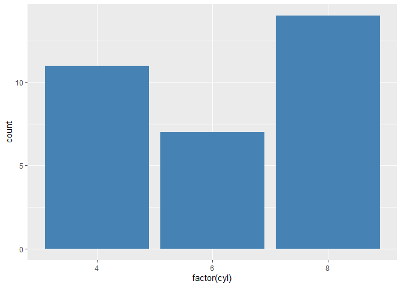

横向

```r
ggplot(mtcars, aes(x = factor(cyl))) +
  geom_bar(fill = "orange") +
  coord_flip()
```


直接使用值

```r
sales_sum <- data.frame(
  dept = c("A", "B", "C"),
  revenue = c(120, 150, 100)
)

ggplot(sales_sum, aes(x = dept, y = revenue)) +
  geom_col(fill = "darkgreen")
```
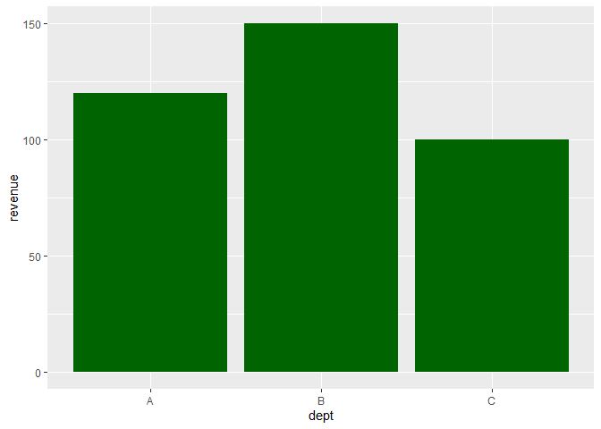

平均值

```r
ggplot(mtcars, aes(x = factor(cyl), y = mpg)) +
  stat_summary(fun = mean, geom = "bar")
```
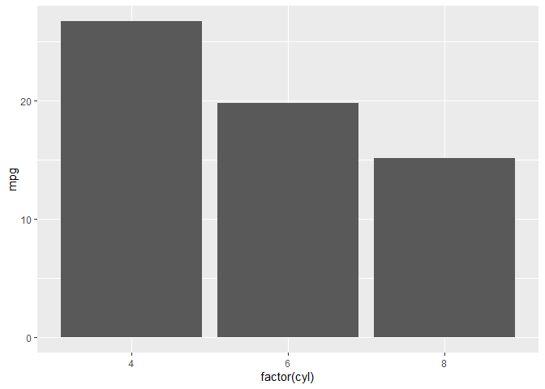

分组柱状图

```r
sales_quarter <- data.frame(
  dept = rep(c("A", "B"), each = 4),
  quarter = rep(paste0("Q", 1:4), 2),
  revenue = c(120, 135, 150, 160, 100, 115, 130, 140)
)

ggplot(sales_quarter, aes(x = quarter, y = revenue, fill = dept)) +
  geom_col(position = "dodge")  # 并排柱状图
```
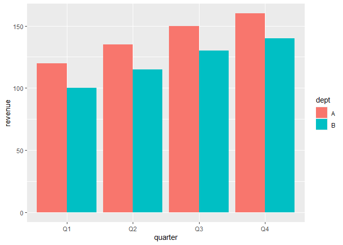

堆叠柱状图

```r
ggplot(sales_quarter, aes(x = quarter, y = revenue, fill = dept)) +
  geom_col(position = "stack")
```


百分比柱状图

```r
ggplot(sales_quarter, aes(x = quarter, y = revenue, fill = dept)) +
  geom_col(position = "fill")
```


### 箱线图

基本

```r
ggplot(mtcars, aes(x = factor(cyl), y = mpg)) +
  geom_boxplot(fill = "skyblue")
```


```r
ggplot(mtcars, aes(x = factor(cyl), y = mpg)) +
  geom_boxplot(fill = "lightgray") +
  geom_jitter(width = 0.2, color = "red", alpha = 0.6)  # 点稍微错开一些
```


水平箱线图 (改 factor 为 y)

```r
ggplot(mtcars, aes(x = mpg, y = factor(cyl))) +
  geom_boxplot(fill = "lightgreen")
```
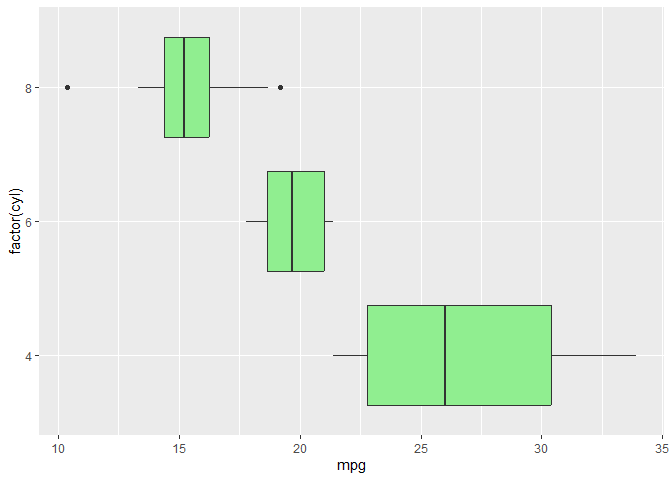

### 小提琴图

基本

```r
ggplot(mtcars, aes(x = factor(cyl), y = mpg)) +
  geom_violin(fill = "lightpink")
```


加上箱线图

```r
ggplot(mtcars, aes(x = factor(cyl), y = mpg)) +
  geom_violin(fill = "lightblue", alpha = 0.6) +
  geom_boxplot(width = 0.2, fill = "white")
```


加散点

```r
ggplot(mtcars, aes(x = factor(cyl), y = mpg)) +
  geom_violin(fill = "lightyellow", alpha = 0.7) +
  geom_jitter(width = 0.2, size = 2, alpha = 0.6, color = "darkred")
```
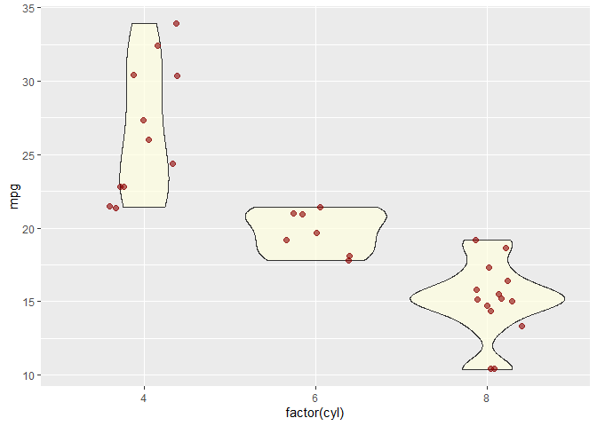

### 直方图

```r
ggplot(mtcars, aes(x = mpg)) +
  geom_histogram(binwidth = 2, fill = "skyblue", color = "black")
```


### 密度图

```r
ggplot(mtcars, aes(x = mpg)) +
  geom_density(fill = "lightgreen", alpha = 0.6)
```


### 面积图

```r
library(dplyr)

sales <- data.frame(
  month = 1:12,
  value = c(100, 120, 150, 160, 180, 200, 220, 210, 230, 240, 260, 280)
)

ggplot(sales, aes(x = month, y = value)) +
  geom_area(fill = "lightblue", alpha = 0.6)
```


### 热力图

```r
df <- expand.grid(x = 1:10, y = 1:10)
df$z <- runif(100, 1, 20)

ggplot(df, aes(x, y, fill = z)) +
  geom_tile()
```
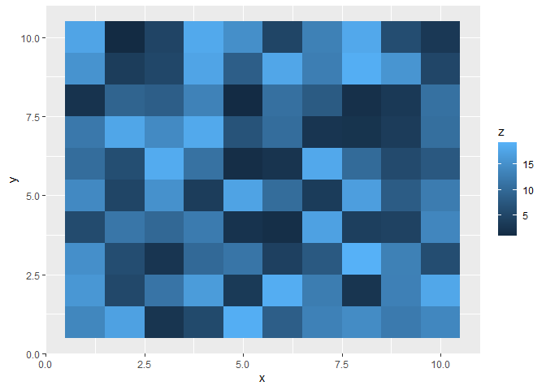

### 饼图 (`geom_bar + coord_polar`)

```r
df <- data.frame(
  category = c("A", "B", "C"),
  value = c(30, 45, 25)
)

ggplot(df, aes(x = "", y = value, fill = category)) +
  geom_col(width = 1) +
  coord_polar(theta = "y")
```
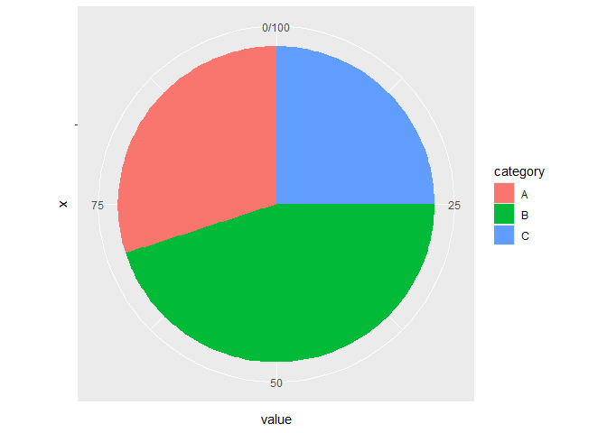

### 雷达图

使用 `fmsb`

```r
library(fmsb)

# 准备数据：第一行 = 最大值，第二行 = 最小值
df <- data.frame(
  A = c(10, 0, 8, 3),
  B = c(10, 0, 7, 4),
  C = c(10, 0, 6, 2),
  D = c(10, 0, 9, 5),
  E = c(10, 0, 7, 3)
)

# 画雷达图
radarchart(df,
           axistype = 1,
           pcol = c("red", "blue"),
           plwd = 2,
           plty = 1,
           cglcol = "grey", cglty = 1, axislabcol = "grey",
           vlcex = 0.8)
```
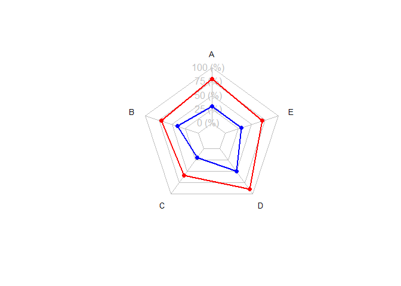
