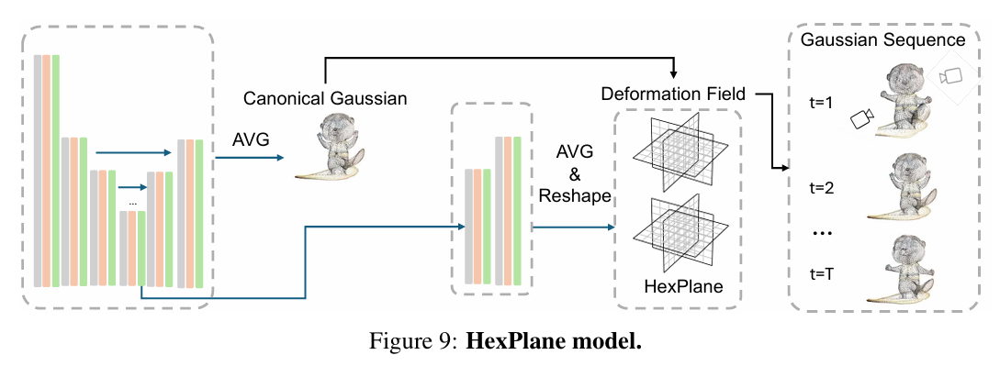

[文章链接 L4GM:Large 4D Gaussian Reconstruction Model](https://arxiv.org/abs/2406.10324v1)

最近一直在 test L4GM 然后之后还要学怎么微调蛤，有必要好好看一看这个论文了。（其实还有 SV4D）

现在大多数 4D 生成模型都是从现有的预训练 3D 生成模型创建而来的，L4GM 就是基于 LGM (大型多视图高斯模型) 的。

## LGM (简介)

基本流程：输入图像 (其实可以是文本或者二者混合) --> 从单一视角生成多个视角图片 (可选，取决于input 是不是多个视角的) --> Gaussian --> Grid Model

具体说，输入是一组图像 ($V$ 个) 和每组图像对应的相机外参，每组相机外参将被转换为 Plücker Ray Embedding，和图像的特征拼接；接着将该拼接的 embedding 输入到一个非对称的 **U-Net**，最后输出 $V$ 个 14 通道的特征图 (feature map)，其中每个像素 (14个通道) 便是该 Gaussian 的 14 个参数

## L4GM

!!! remarks "Score Distillation (分数蒸馏)"
    特别用于扩散模型；  
    Score Distillation 就是用一个已经训练好的扩散模型（teacher）来“指导”另一个模型或场景（student）去生成高质量的结果，而不用重新训练整个扩散模型。~~具体以后再说~~

作者认为，使用 Score Distillation 对 prompt 敏感而且 time consuming (需要多次迭代)  

**目标**：单目视频 (monocular video) --> 高斯序列 

### 具体做法 (优化点)

**1. 第一帧用 3D 生成模型进行多视角生成**  

使用 ImageDream 模型 (一个 diffusion 模型) 生成 4 个正交的采样视角的图像 (第一帧 $I_1$)。由于目的是保留三个生成视角和 input 垂直 (这里是在水平面上的 $0^\circ, 90^\circ, 180^\circ, 270^\circ$)，作者采用了先生成一系列方位角 (azimuth，特指水平环绕角) 的视角 $P_{\text{init}}$，再取其中与 input “最接近” 的视角，再取与之垂直的另外三个视角进行生成。

!!! remarks "怎样判定 “最接近”？"
    取方位角 $\theta_{\text{align}} = \mathrm{argmin} \Vert f(P_{\text{static}, \theta}) - I_1\Vert^2$ (其实就是 L2 距离最小的角度啦)

**2. 加入 Temporal Self-attention (时序自注意力) 层 (temp-attention)** 

!!! normal-comment "模型假设相机位置不发生变化。"

为保证不同帧之间的连续性 (consistency)，需要在 LGM 的基础上加入**时序自注意力**层。

也即处理合并之后的 embedding ($\texttt{(B T V) H W C}$) ($\texttt{B}$ 是 batch size) 输入 U-Net 之后，进行如下处理：

$$
\begin{aligned}
\mathbf{x} &= \texttt{rearrange}(\mathbf{x}, \texttt{(B T V) H W C} \to \texttt{(B V)(T H W) C}) \\
\mathbf{x} &= \mathbf{x} + \text{TempSelfAttn}(\mathbf{x}) \\
\mathbf{x} &= \texttt{rearrange}(\mathbf{x}, \texttt{(B V)(T H W) C} \to \texttt{(B T V) H W C})
\end{aligned}
$$

!!! remarks "符号注释"
    | 符号       | 含义                            |
    | -------- | ----------------------------- |
    | **B**    | Batch size（批大小）               |
    | **T**    | 时间步（Temporal dimension），视频帧数量 |
    | **V**    | 视角数（View dimension），多视角数量     |
    | **H, W** | 空间尺寸（Height, Width）           |
    | **C**    | 通道数（Channel），即每个像素的特征维度       |

上面的操作把时间维度 ($\texttt{T}$) 展开到空间维度 ($\texttt{H W}$) 中，便方便做时序自注意力

**3. Loss Function 的设计**

!!! remarks "作为评估，我们常称之为 metric"

输入视角记为 $\mathcal{O}$, 用来检验重建视角的多个 eval 视角 $\mathcal{O}_{\mathrm{sup}}$.

$$
\begin{align}
\mathcal{L}_{\text{RGB}} 
&= \sum_{t=1}^{T} \sum_{O \in \mathcal{O} \cup \mathcal{O}_{\text{sup}}} 
\| I_t^O - f(P_t, O) \|_2^2 + \lambda \mathcal{L}_{\text{LPIPS}}(I_t^O, f(P_t, O)), \\
\mathcal{L}_{\text{Mask}} 
&= \sum_{t=1}^{T} \sum_{O \in \mathcal{O} \cup \mathcal{O}_{\text{sup}}} 
\| \alpha_t^O - g(P_t, O) \|_2^2, \\
\mathcal{L} 
&= \mathcal{L}_{\text{RGB}} + \mathcal{L}_{\text{Mask}},
\end{align}
$$

其中 RGB 部分使用 MSE 和 **感知损失** (LPIPS, Learned Perceptual Image Patch Similarity)的组合，mask 部分 (alpha 值图像) 使用 MSE, 用于评估重建物体的形状和边界的准确度

**4. 自回归重建**

给一个固定长度 $T$ 的值，如果更长的视频将采用分长度为 $T$ 的小视频分块处理。上一块的最后帧的生成结果会参与下一块的 Gaussian 生成，这个方法保证了时间记忆的连续性（为什么啊）

**5. 插值模型**

为了保证时间帧之间的连续性（本来训练的模型在两帧 Gaussian 之间是没有关联的，可能会导致时间变化的不规律，而且无法直接在 Gaussian 之间插值），训练了一个 4D 插值模型 (L4GM 上微调的结果)，通过前后两帧的 Gaussian 和提前通过平均计算的 RGB 插值的参考帧来生成中间帧对应的 Gaussian (1)
{ .annotate}

1. a test annotate

### 实验部分

其它不看了，看看**消融实验** (ablation study)

!!! remarks "什么是消融实验"
    不断地减少系统的不同模块，检查哪些模块对系统结果影响比较大

这里作者分别进行了：去除 3D 预训练模型、冻结 LGM (不参与训练，只训练 temp attn 层)、去除 temp attn 层、加入形变场等

!!! remarks "形变场"
    将一个 4D 内容表示为一个 3D 物体和一个动态的形变表示，3D + 形变 表示某一帧。为了更好表示 4D 形变场，使用 HexPlane，表示更加高效.

    

就先这样吧……
